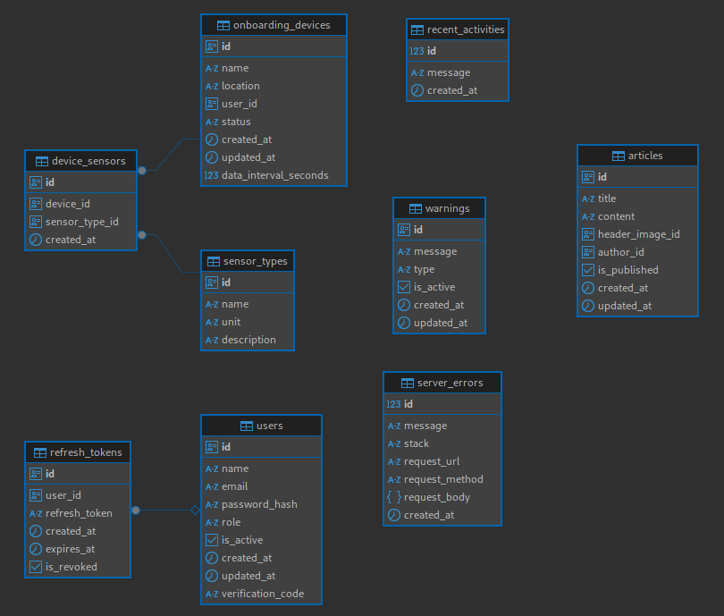
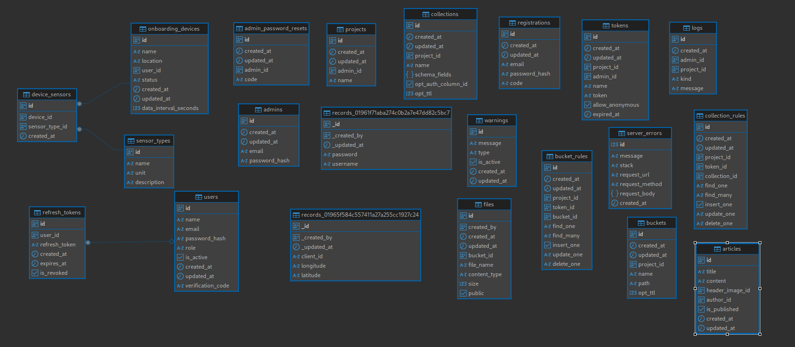

# Database & Architecture

Sistem ini menggunakan **dua jenis database** dan memiliki dua level arsitektur yang perlu dipahami agar implementasi dan integrasi berjalan dengan benar.

---

## 1. Standalone Architecture (Sistem Sendiri)

Pada desain awal, sistem berjalan menggunakan **PostgreSQL** sebagai database utama.  
Semua tabel inti seperti `onboarding_devices`, `device_sensors`, `users`, `articles`, dan lain-lain berada dalam PostgreSQL.  
Data sensor langsung diproses dan disimpan ke tabel-tabel tersebut tanpa perantara.

---

## 2. Integrated Architecture (Sistem Terintegrasi dengan Hyperbase)

Untuk sistem yang **siap produksi** dan **skalabilitas besar**, arsitektur diperluas dengan mengintegrasikan **Hyperbase**.  
Hyperbase digunakan untuk menyimpan *raw data* dari perangkat IoT sebelum data itu diolah dan dimasukkan ke PostgreSQL.

**Penjelasan alur integrasi:**
- Perangkat IoT mengirim data *raw* melalui MQTT ke backend.
- Backend menyimpan data mentah di **Hyperbase** sebagai data historis yang scalable.
- Proses ETL (Extract, Transform, Load) memindahkan data yang sudah diproses ke **PostgreSQL** untuk kebutuhan query cepat.
- Dashboard publik dan panel admin tetap hanya membaca data dari PostgreSQL.

---

## 3. Relasi Antar Tabel (PostgreSQL)

Beberapa tabel utama di PostgreSQL:

| Tabel | Deskripsi Singkat |
|-------|------------------|
| `onboarding_devices` | Menyimpan daftar perangkat yang terdaftar |
| `device_sensors` | Menyimpan jenis sensor yang terpasang pada setiap perangkat |
| `sensor_types` | Master data jenis sensor |
| `users` | Data admin/operator, termasuk autentikasi |
| `articles` | Konten informasi dan edukasi |
| `warnings` | Peringatan dini dari sistem |
| `server_errors` | Log error yang tercatat |
| `refresh_tokens` | Token refresh untuk autentikasi |

---
