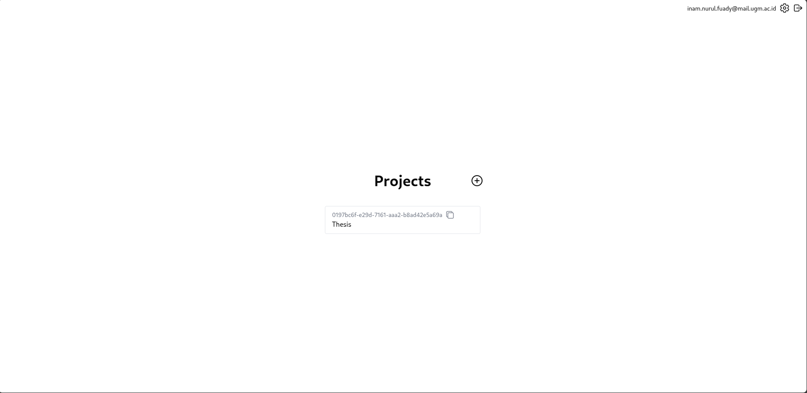
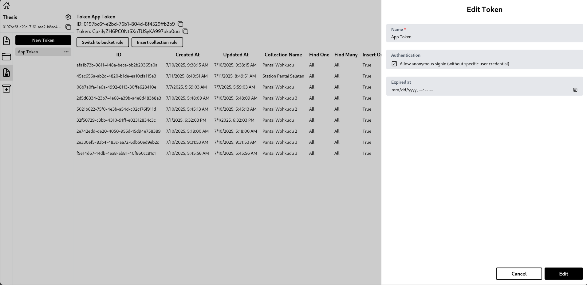

# Panduan Setup Dashboard Miniweather Station

Panduan ini akan membimbing Anda dalam menyiapkan tiga layanan utama: **Backend API**, **Dashboard Publik**, dan **Panel Admin**.

---

## 1. Prasyarat

- Pastikan Docker dan Docker Compose telah terinstal.
- Node.js dan npm opsional (jika tidak menggunakan Docker).
- Akses ke proyek Hyperbase dan token yang dibutuhkan.

---

## 2. Setup Proyek di Hyperbase

Sebelum menjalankan layanan, Anda perlu menyiapkan token di Hyperbase:

- Masuk ke halaman Hyperbase.
- Buka proyek anda&#x20;

- Buat atau edit Token App.&#x20;

- Aktifkan opsi **Allow anonymous signin** seperti pada gambar yang tersedia.
- Pastikan token tersebut memiliki akses ke koleksi yang diperlukan (Find One, Find Many, Insert).

**Data yang diperlukan:**

- **Project ID:** `0197bc6f-e29d-7161-aaa2-b8ad42e5a69a`
- **Host URL:** `http://localhost:8080`
- **Token ID:** `0197bc6f-e2bd-76b1-804d-8f4529ffb2b9`
- **Bucket ID:** `0197bc70-ffc8-7a82-b854-947577abd29e`
- **Auth Token:** `eyJ0eXAiOiJKV1QiLCJhbGciOiJIUzI1NiJ9...`

---

## 3. Clone Repositori

Kloning ketiga repositori berikut:

```bash
# Backend API
git clone https://github.com/Miniweather-Station-Dashboard/miniweather-backend-service-node.git

# Dashboard Publik
git clone https://github.com/Miniweather-Station-Dashboard/miniweather-frontend-service-node.git

# Panel Admin
git clone https://github.com/Miniweather-Station-Dashboard/miniweather-adminpage-service-node.git
```

---

## 4. File Environment

### 📦 Backend API - `.env`

```env
NODE_ENV=dev
HYPERBASE_PROJECT_ID=0197bc6f-e29d-7161-aaa2-b8ad42e5a69a
HYPERBASE_HOST=http://localhost:8080
HYPERBASE_TOKEN_ID=0197bc6f-e2bd-76b1-804d-8f4529ffb2b9
HYPERBASE_BUCKET_ID=0197bc70-ffc8-7a82-b854-947577abd29e
HYPERBASE_AUTH_TOKEN=eyJ0eXAiOiJKV1QiLCJhbGciOiJIUzI1NiJ9...

MQTT_BROKER_URL=mqtt://localhost:1883
MQTT_TOPIC=backend/miniweather
MQTT_HYPERBASE_TOPIC=hyperbase/dev

DB_USER=myuser
DB_PASSWORD=mypassword
DB_HOST=localhost
DB_PORT=5435
DB_NAME=hyperbase

SCYLLA_CONTACT_POINTS=localhost
SCYLLA_LOCAL_DC=datacenter1
SCYLLA_KEYSPACE=hyperbase
SCYLLA_USERNAME=cassandra
SCYLLA_PASSWORD=cassandra
SCYLLA_PORT=9042
DB_TYPE=scylla

JWT_SECRET=ts4S9QrNzyqcGEdnkCahVKuglhHbh27t
JWT_REFRESH_SECRET=yC5cTGXWDC0A3S7UFfE5C7PFCCtxyyFb
JWT_EXPIRATION=10s
JWT_REFRESH_EXPIRATION=1d

GMAIL_USER=user@gmail.com
GMAIL_PASS=apppassword


REDIS_HOST=localhost
REDIS_PORT=6379
REDIS_DB=0
# Jika Redis memiliki autentikasi
# REDIS_USERNAME=default
# REDIS_PASSWORD=passwordanda

SWAGGER_SERVER_URL=http://localhost:3001
```

> **Catatan:** Untuk mendapatkan kredensial Gmail (`GMAIL_USER` dan `GMAIL_PASS`), Anda perlu:
>
> 1. Masuk ke akun Gmail Anda.
> 2. Buka halaman [Google App Passwords](https://myaccount.google.com/apppasswords) (Anda harus mengaktifkan verifikasi 2 langkah terlebih dahulu).
> 3. Pilih jenis aplikasi "Mail" dan perangkat "Other (Custom name)", lalu beri nama seperti "Miniweather".
> 4. Google akan memberikan **App Password** berupa 16 karakter yang digunakan sebagai `GMAIL_PASS`.
> 5. `GMAIL_USER` adalah alamat email Gmail Anda.


### 🌐 Dashboard Publik - `.env`

```env
NEXT_PUBLIC_API_BASE_URL=http://localhost:3001
```

### 🛠️ Panel Admin - `.env`

```env
NEXT_PUBLIC_API_BASE_URL=http://localhost:3001
```

---
## 4.5. Menjalankan Redis Secara Lokal
Sebelum menjalankan layanan backend, pastikan Redis berjalan. Jika Anda menggunakan Docker:

```bash
docker run -d \
  --name redis-miniweather \
  -p 6379:6379 \
  redis:7-alpine
```
Redis akan berjalan di latar belakang pada port default 6379. Anda bisa mengecek statusnya dengan docker ps.

---

## 5. Menjalankan Layanan dengan Docker

Pastikan semua service memiliki `Dockerfile`. Jika belum memiliki `docker-compose.yml`, Anda bisa menjalankannya manual:

```bash
# Backend
cd miniweather-backend-service-node
docker build -t miniweather-backend .
docker run -p 3001:3001 --env-file .env miniweather-backend

# Dashboard Publik
cd ../miniweather-frontend-service-node
docker build -t miniweather-dashboard .
docker run -p 3000:3000 --env-file .env miniweather-dashboard

# Panel Admin
cd ../miniweather-adminpage-service-node
docker build -t miniweather-admin .
docker run -p 3002:3000 --env-file .env miniweather-admin
```

---

## 6. Catatan Tambahan

- Pastikan Hyperbase dapat diakses di `http://localhost:8080`
- Redis dan MQTT juga harus berjalan pada port default (`6379` dan `1883`)
- Anda bisa menggunakan Docker Compose untuk menjalankan seluruh stack sekaligus jika diinginkan

---

## 7. Akses Aplikasi

- Panel Admin: `http://localhost:3002`
- Dashboard Publik: `http://localhost:3000`
- API Swagger: `http://localhost:3001/docs` (jika tersedia)

---

Selamat mencoba dan semoga lancar!
