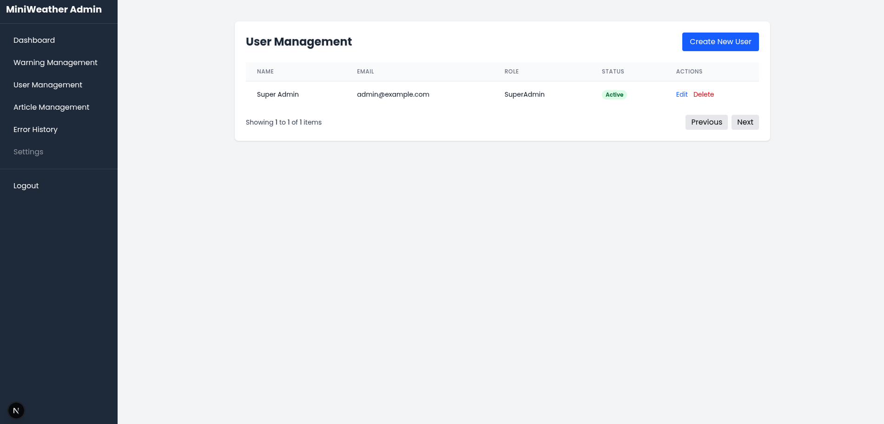
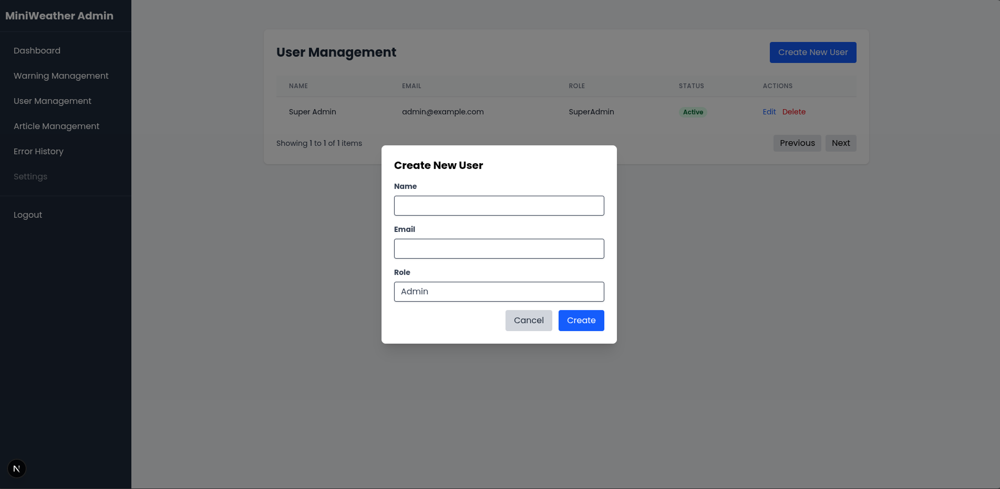
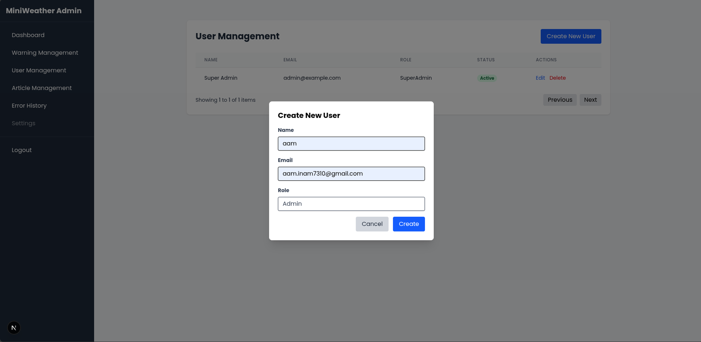
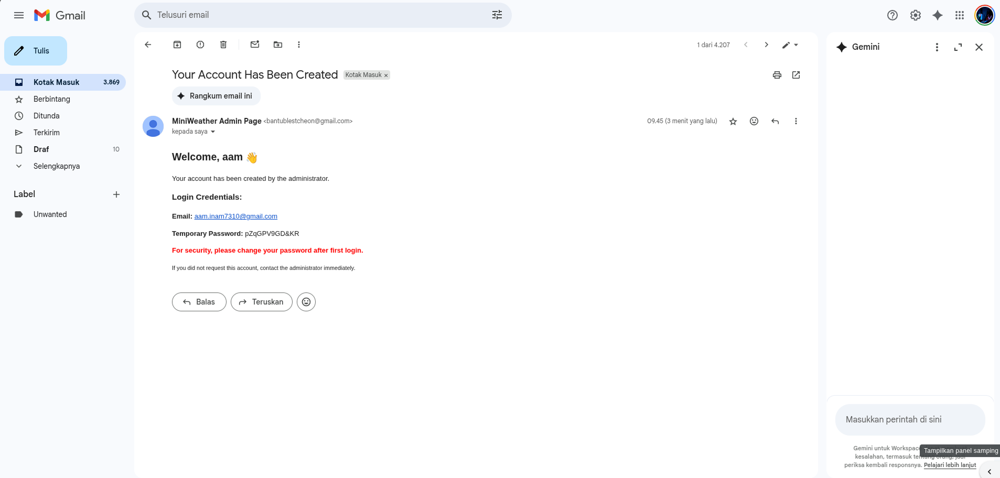
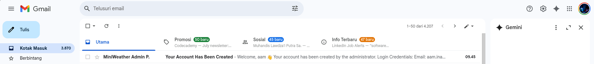
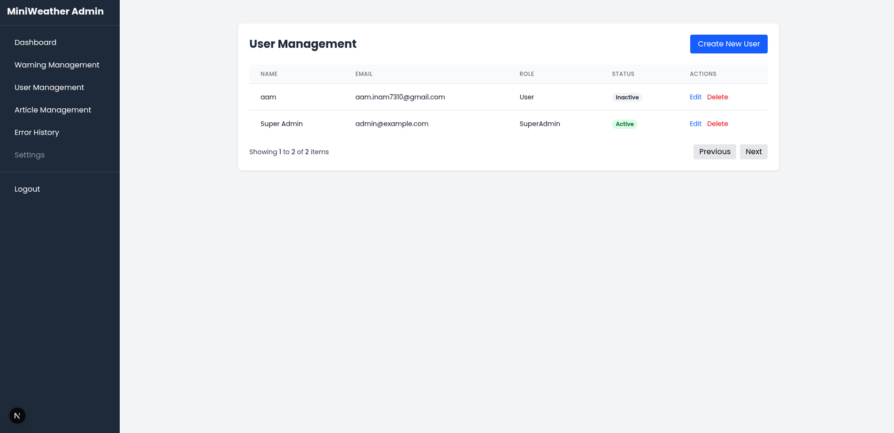

# Manage Users

Fitur manajemen pengguna digunakan oleh SuperAdmin untuk menambahkan, menghapus, atau mengatur akun pengguna (User atau Admin) yang dapat mengakses sistem Miniweather Station Dashboard.

---

## ✅ 1. Akses Menu User Management

Klik menu **User Management** dari sidebar untuk melihat daftar pengguna saat ini.

---

## ➕ 2. Tambahkan Pengguna Baru

Klik tombol **Create New User** di kanan atas untuk membuka form penambahan.

---

## 📝 3. Isi Form Pengguna

Isi formulir berikut:

- **Name**: Nama pengguna
- **Email**: Email pengguna
- **Role**: Pilih peran `Admin`, `SuperAdmin`, atau `User`

> ⚠️ Setelah mengisi, klik tombol **Create**

---

## 📧 4. Cek Email Pengguna

Setelah akun dibuat, sistem akan mengirimkan email otomatis ke alamat email pengguna yang berisi kredensial login.

Pengguna akan menerima email dengan isi seperti:

- **Email**: alamat email terdaftar
- **Temporary Password**: sandi awal untuk login
- Catatan: fitur ganti password masih dalam pengembangan

---

## ✅ 5. Verifikasi Data di Tabel

Setelah berhasil dibuat, pengguna akan muncul di daftar manajemen dengan status:

- **Active**: Jika sudah aktif
- **Inactive**: Jika akun belum digunakan untuk login pertama kali

---

## 🛠️ Catatan Teknis

- Password awal bersifat sementara dan dikirim via email
- Akun dengan role `SuperAdmin` memiliki akses penuh, termasuk pengelolaan user
- Hanya `SuperAdmin` yang dapat membuat akun baru

---

Dengan fitur ini, pengelolaan akun pengguna menjadi lebih terstruktur dan aman. Admin dapat mengatur siapa saja yang dapat menggunakan sistem, serta melakukan kontrol akses berdasarkan peran.
