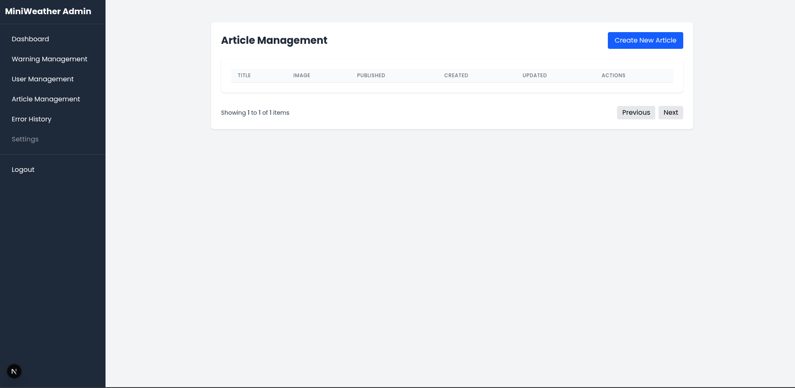
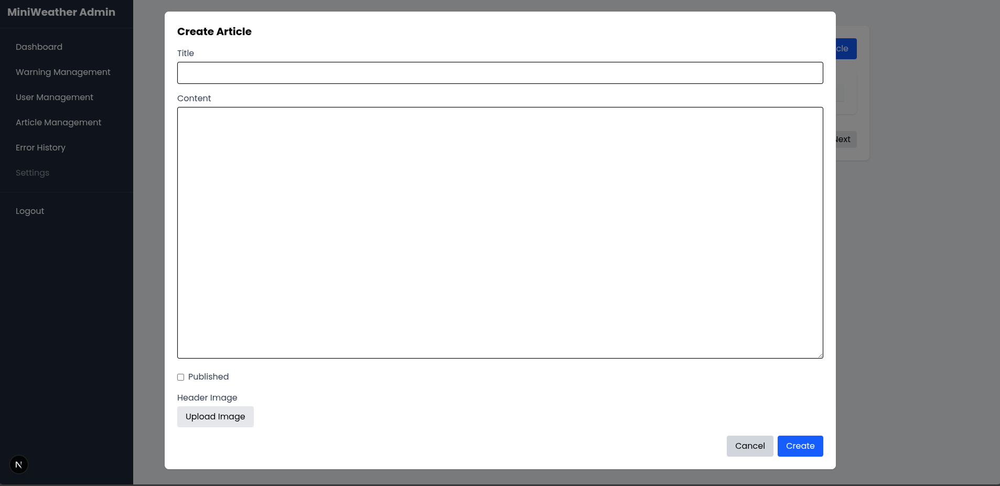
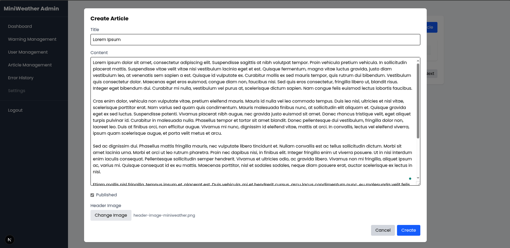
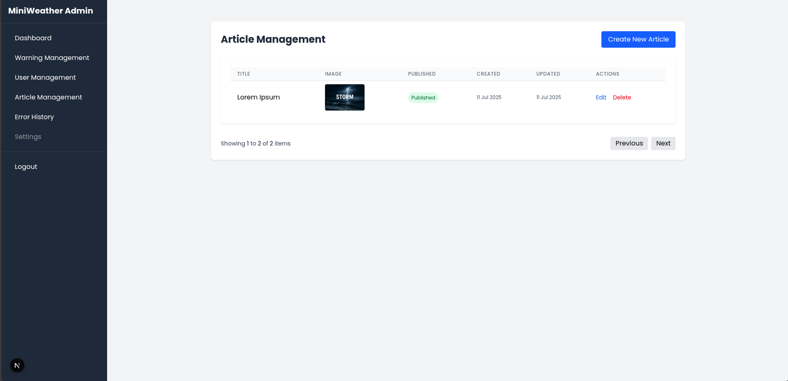
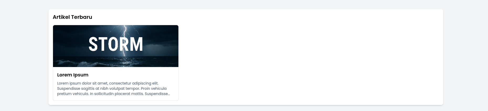

# Manage Articles

Halaman ini menjelaskan proses untuk menambahkan dan mengelola artikel yang ditampilkan di halaman publik Miniweather Station Dashboard. Artikel digunakan untuk menyampaikan informasi, edukasi, atau update terkini yang berkaitan dengan cuaca atau lingkungan.

---

## 🧭 1. Akses Menu Artikel

Setelah login sebagai admin, buka menu **Article Management** dari sidebar.



---

## ➕ 2. Tambahkan Artikel Baru

Klik tombol **Create New Article** untuk membuka form penambahan artikel.



---

## 📝 3. Isi Form Artikel

Lengkapi formulir berikut:

- **Title**: Judul artikel
- **Content**: Isi artikel (boleh panjang)
- **Header Image**: Gambar utama artikel
- **Published**: Centang jika ingin artikel langsung ditampilkan di dashboard publik



---

## 💾 4. Simpan Artikel

Klik tombol **Create** untuk menyimpan artikel. Jika berhasil, artikel akan tampil di tabel manajemen seperti ini:



---

## 🌐 5. Artikel Tampil di Halaman Publik

Artikel yang sudah berstatus *Published* akan langsung muncul di halaman publik dalam bagian **Artikel Terbaru**.



---

## 🛠️ Catatan Teknis

- Endpoint backend:
 ```
 POST /v1/articles
Authorization: Bearer <admin-token>

 ```

- Gambar yang diunggah akan disimpan dan ditautkan ke artikel
- Artikel yang belum dicentang sebagai “Published” hanya akan disimpan, tapi tidak ditampilkan di dashboard publik

---

Dengan fitur ini, admin dapat menyampaikan informasi penting atau edukatif kepada pengguna secara menarik dan informatif.


