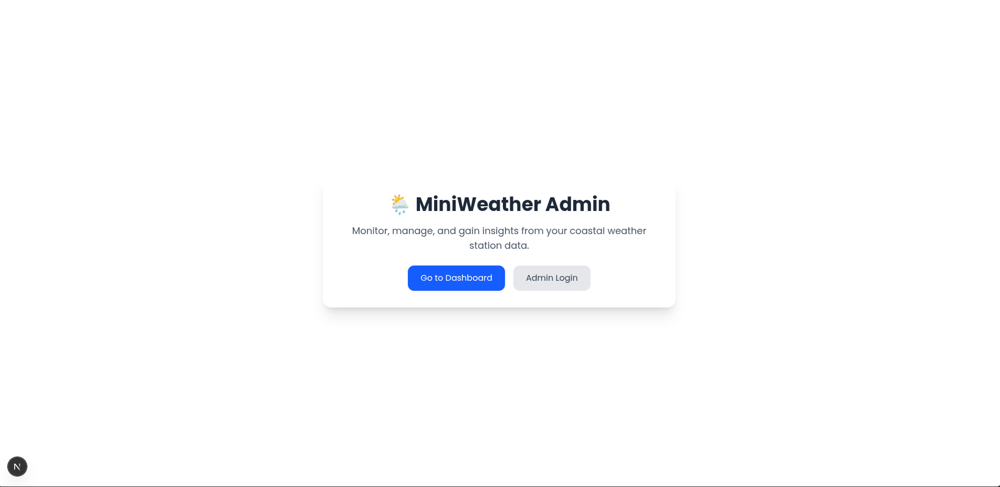
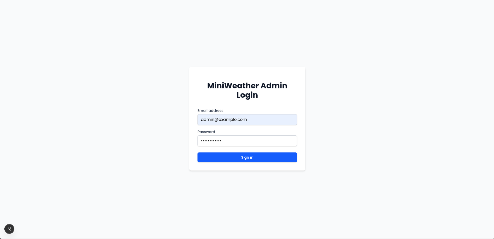
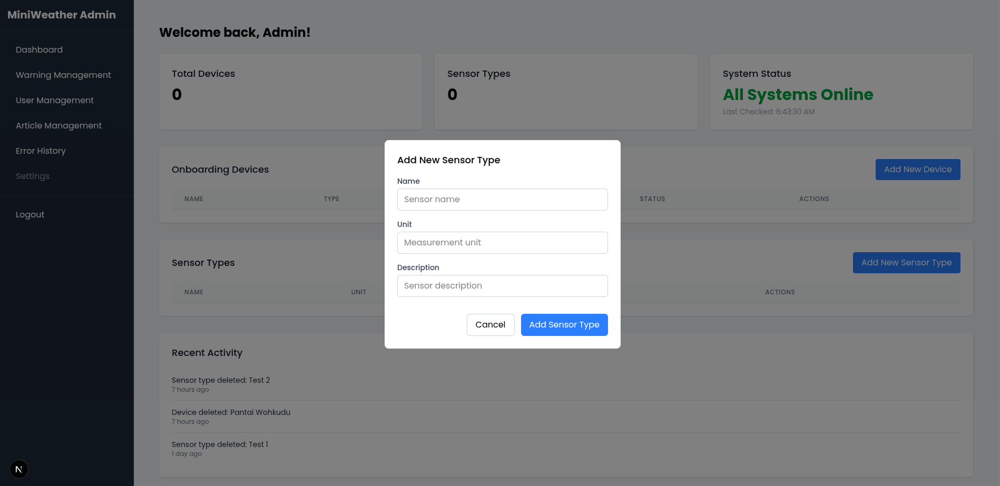
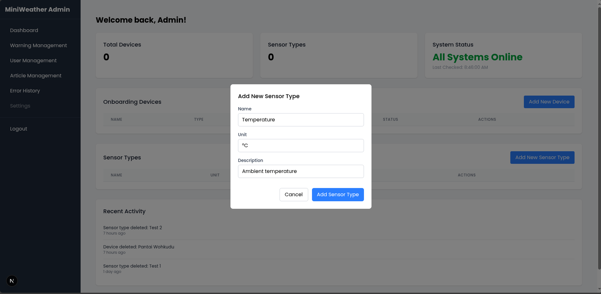
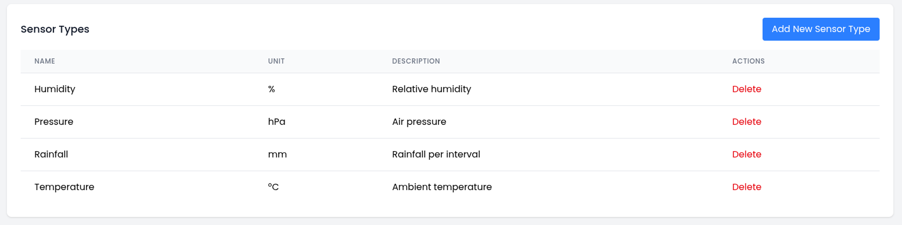
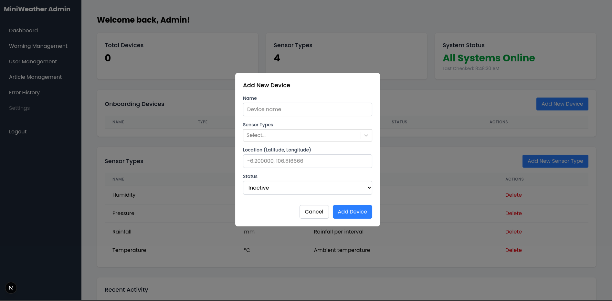
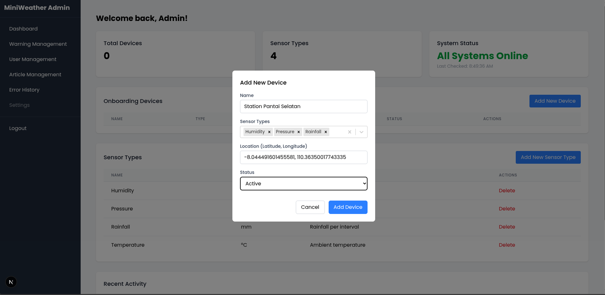
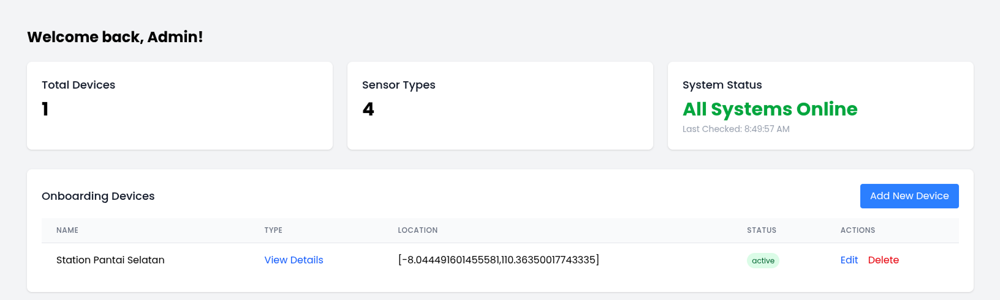

# Add Onboarding Device

Untuk menambahkan perangkat baru (IoT device) ke sistem Miniweather Station Dashboard, ikuti langkah-langkah berikut:

---

## ✅ Sebagai Admin (Menambahkan Perangkat lewat UI)

### 1. Masuk ke Halaman Utama

Setelah masuk ke link panel admin, kamu akan diarahkan ke halaman utama. Tekan tombol admin login

---

### 2. Login ke Admin Panel

Buka halaman login admin di `/admin/login`, lalu masukkan kredensial.

---

### 3. Buka Halaman Manajemen Perangkat

Klik menu "Dashboard" untuk membuka halaman pengelolaan perangkat.

---

### 4. Klik Tombol `+ Add Sensor Types`

Tekan tombol **+ Add Sensor Types** untuk membuka form penambahan penambahan sensor.

---

### 5. Isi Form Penambahan Sensor

Isi data perangkat sesuai dengan form yang tersedia:

- **Name** (misal: `Temperature`)
- **Unit** (unik, misal: `°C`)
- **Description** (misal: `Ambient temperature`)

---
### 6. Hasil dari Penambahan Sensor 

Berikut merupakan sensor yang sudah ditambahkan apabila berhasil

---
### 7. Klik Tombol `+ Add Device`

Tekan tombol **+ Add Device** untuk membuka form penambahan.

---

### 8. Isi Form Penambahan Perangkat

Isi data perangkat sesuai dengan form yang tersedia:

- **Device Name** (misal: `Station Pantai Selatan`)
- **Location** (latitude dan longitude, misal: `-7.7956, 110.3695`)
- dan seterusnya

---

### 9. Klik Save

Simpan data untuk mendaftarkan perangkat baru ke sistem.

---

## 📦 Hasil Setelah Menambahkan Device

Setelah berhasil ditambahkan, data perangkat akan muncul di halaman list device seperti berikut:

---